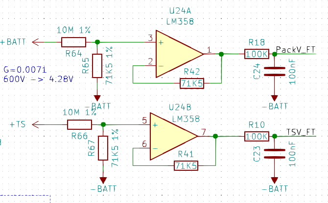

# Mainboard BMS

The goal has been creating a solid design that I hope will be carried forward with only minor adaptiations to the following team cars.

## Connections
-

## Feedbacks
What to feedback:

- SD_IN
- SD_OUT
- SD_END (no mux)
- SD_RELAY_D (no mux)
- TSAL
- AIR+_STATUS
- AIR-_STATUS
- AIR+_GATE
- AIR-_GATE
- TS_ON
- IMD_FAULT (no mux)
- IMD_LATCHED
- BMS_LATCHED
- EXT_LATCHED
- EXT_FAULT
- TS_OVER_60V_STATUS
- PRECHARGE_STATUS
- MUX_CHECK

The feedbacks are stepped down from the $12V$ logic to the $3.3V$ of the microcontroller. The signals, unless specified above, are the fed to a multiplexer CD74HC4067SM.


## TS side
### Buffers



To feed the TS voltage into the ADC we use a voltage divider with the values in the image.

The OPAMP used as buffers are standard LM358, the main characteristics we are interested in are:
- Input bias current: $I_b = 45 nA$
- Output saturation voltage: $V_{OH} = V_{cc} - 1.5V = 3.5V$
The first limits the maximum value the voltage divider resistors can have, and with $R_{65} = 10M$ the current is $6uA$ at $60V$ still factor of $100$ more than $I_b$.
The second sets the maximum voltage to be buffered and in our case it's $3.2V$ at $V_{BATT} = 450V$ with some margin to limit non-linearities in the OPAMP and use an ADC at $V_{REF} = 3.3V$.

The gain is thus:
$G = \frac{R_{65}}{R_{65}+R_{64}} \approx 0.0071$

On the feedback line a resistor equal to the output impedence of the divider (hence equal to the lower resistor) is placed to remove the input bias current offset contribution at first order.

The filter cutoff frequency is:
$\omega_LP = \frac{1}{R_{18} C_{24}} = 100 rad/s \ (~16Hz)$

### ADC
Requirements:
- >= 3channels
- > 10bit
- ~ 500kbps
- Visolation > 1800V
- > 10 conversion per second
- < 10us of conversion time

The choice of the ADC was carried out taking into account the availability of the current market, previously the Si8900 IC was employed but it's no more in stock.
```{note}
The Si8900 was great because it integrated in an single package a 10bit SAR ADC and an isolation layer for the UART communication thus reducing BOM entries, space and microcontroller connections.
```

Wanting now to have a more future proof choice it has been decided to switch to a more standard configuration of separated ADC and isolation. UART devices are not common and I2C is more complex to isolate (but doable with a MAX14850). The most widespread ADCs are SPI and is simple to isolate eventhough it requires more lanes
The supply of the ADC is setted to 3.3V since the buffering OPAMP is powered from 5V and saturates.
The configuration choosen is:
- ADC124S021
	- 4 channels
	- 12bit
	- 200kbps
	- R series MUX 500Ohm
	- 50pF hold capacitance
	- 3.3V compatible

- MAX2245
- MAX2246
	- 3.3V compatible
	- 200Mbps
	- 5kV isolationwithstand

The ADC is then connected to the SPI1 on the microcontroller.


## Fan control

From TIM3_CH1 of the microcontroller put out a 25kHz PWM to control the fans.
The power for the fans is not routed to the mainboard, GND and +12V goes from the connector to the fan with a series fuse TBD on the 12V line.

## Buzzer

The buzzer is used to signal an urgency inside the TSAC.
Such emergencies are:
- Inconsistencies between control and feedbacks on the AIRs
- Prolungated overtemperature
- Fan failure

## CAN

The CAN transceiver for the communication with the outside of the TSAC is the MCP2562 which is also used in the rest of the vehicle. The termination resistor has the place to be soldered but of course it's only necessary at the end of the bus so it can be soldered in one pad only and orientated away from the other pad.
